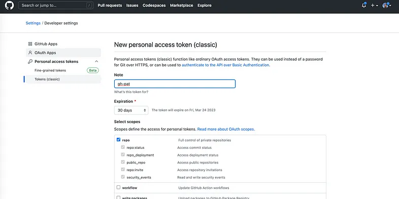
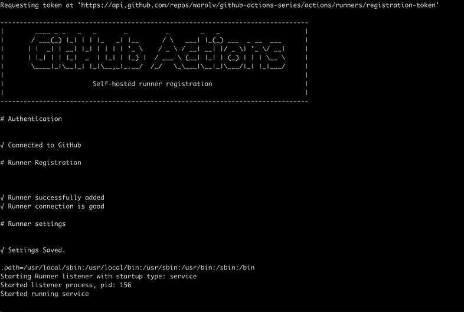
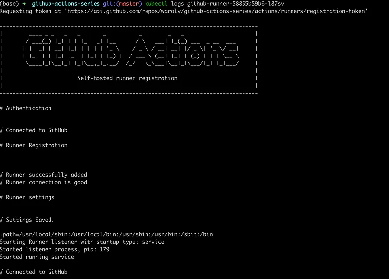

# GitOps way with Github Actions and self-hosted runner on Kubernetes


In this tutorial, I will show how to:

1. Deploy self-hosted-runner to Kubernetes and connect it with your GitHub repo.

2. Redeploy Nginx server on your k8s cluster with every change in nginx/deployment.yaml, which pushed to Github repo.

> "Every change in configuration of deployment.yaml on Github will be propagated to Nginx server."


## So, why self-hosted runner?

The reason for self-hosted runner is coming from security limitation ( in my case), I have an internal k8s cluster which is not externally reachable and can be accessed only via VPN.

**So how it works if the cluster can’t be reached externally?**

> **Communication between self-hosted runners and GitHub**

The self-hosted runner connects to GitHub to receive job assignments and to download new versions of the runner application. The self-hosted runner uses an HTTPS long poll that opens a connection to GitHub for 50 seconds, and if no response is received, it then times out and creates a new long poll. The application must be running on the machine to accept and run GitHub Actions jobs.
Since the self-hosted runner opens a connection to GitHub.com, you do not need to allow GitHub to make inbound connections to your self-hosted runner.

meaning self-hosted runner using https polling to talk with Github, but Github not talking directly with self-hosted runners.

## Let’s do it

### Need to generate Github’s Personal access token (PAT) first

Go to your Github account -> https://github.com/settings/profile, then to

Developer settings -> Generate new token



### Provision of self-hosted runner to k8s

I will use Dockerfile for self-hosted runner from this repo: [Github self-hosted](https://github.com/SanderKnape/github-runner)


> by Sander Knape, https://sanderknape.com/2020/03/self-hosted-github-actions-runner-kubernetes/


### Validation of PAT by running self-hosted runner as docker container

```bash
docker run --name github-runner \
     -e GITHUB_OWNER=warolv \
     -e GITHUB_REPOSITORY=github-actions-series \
     -e GITHUB_PAT=YOUR_GITHUB_PAT \
     sanderknape/github-runner
```


> I am using my Github account for testing: warolv, repo is ‘github-actions-series’ and PAT we generated previously




Go to your Github repo -> settings -> Actions -> runners, you will see new self-hosted runner:


self-hosted runner is connected to Github and ready to do the job, looks good:-)

Next step will be to deploy it to k8s.

### I will use my ‘kind’ k8s cluster for demo:

https://kind.sigs.k8s.io/

```bash
kind create cluster
```

### Now let’s actually provision self-hosted runner to k8s

First clone my repo: git clone git@github.com:warolv/github-actions-series.git


### Creating of k8s secret with PAT in namespace: ‘github-runner’

```bash
# create github-runner namespace
kubectl create ns github-runner

# create secret from PAT we got previously
kubectl create secret generic gh-pat \
    -n github-runner \
    --from-literal=pat=YOUR_GITHUB_PAT
```

### Overview of manifests for deployment

**gr-deployment.yaml** (self-hosted-runner/gr-deployment.yaml in cloned repo)

```yaml
apiVersion: apps/v1
kind: Deployment
metadata:
  name: github-runner
  namespace: github-runner
  labels:
    app: github-runner
spec:
  replicas: 1
  selector:
    matchLabels:
      app: github-runner
  template:
    metadata:
      labels:
        app: github-runner
    spec:
      serviceAccountName: gr-sa
      containers:
      - name: github-runner
        image: sanderknape/github-runner:latest
        env:
        - name: GITHUB_OWNER
          value: warolv
        - name: GITHUB_REPOSITORY
          value: github-actions-series
        - name: RUNNER_LABELS
          value: self-hosted-runner
        - name: GITHUB_PAT
          valueFrom:
            secretKeyRef:
              name: gh-pat
              key: pat
        lifecycle:
          postStart:
            exec:
              command: ["sh", "-c", "install kubectl..."]
```

***For deployment of self-hosted runner to k8s, you need to set proper values for:***

1. **GITHUB_OWNER:** warolv in my case
2. **GITHUB_REPOSITORY:** [ github-actions-series], for my demo
3. **RUNNER_LABELS:** [ self-hosted-runner ], used in workflow
4. **GITHUB_PAT:** taken from k8s secret we created previously


Also we installing ‘kubectl’ to existing runner using ‘lifecycle poststart’ hook, we need kubectl to redeploy Nginx on configuration change.


> PostStart

The PostStart hook is called immediately after a container is created. This occurs as it transitions into the Running phase after its Waiting period.

**gr_sa.yaml** is a service account which will be attached to runner, in order to have permissions for redeploying Nginx.

```yaml
apiVersion: v1
kind: ServiceAccount
metadata:
  name: gr-sa
  namespace: github-runner
```

**gr-cluster-role.yaml** and **gr-cluster-role-binding.yaml** is a binding of needed permissions to ‘gr-sa’ service account.

```yaml
apiVersion: rbac.authorization.k8s.io/v1
kind: ClusterRole
metadata:
  name: pod-handler
rules:
- apiGroups: ["apps"]
  resources: ["pods", "deployments"]
  verbs: ["get", "list", "watch", "create", "update", "patch", "delete"]
```

```yaml
apiVersion: rbac.authorization.k8s.io/v1
kind: ClusterRoleBinding
metadata:
  name: pod-handler-binding
  namespace: github-runner
roleRef: 
  apiGroup: rbac.authorization.k8s.io
  kind: ClusterRole
  name: pod-handler 
subjects:
- kind: ServiceAccount
  name: gr-sa
  namespace: github-runner
```

### Let’s deploy all needed manifests in self-hosted-runner folder

```bash
kubectl apply -f self-hosted-runner
```


### Validate self-hosted-runner is running and connected

```bash
kubectl get pods
github-runner-58855b59b6-l87sv   1/1     Running   0          165m

kubectl logs github-runner-58855b59b6-l87sv
```





### Add Github Workflow to redeploy Nginx on configuration change

Last step actually would be to create workflow with Github Actions to redeploy Nginx server on configuration change, when **nginx/deployment.yaml** is changed, committed and pushed to repo.

.github/workflows/nginx_redeploy.yaml

```yaml
name: Redeploy nginx after changes in deployment.yaml
on:
  push:
    paths:
      - nginx/**

jobs:
  redeploy-nginx:
    runs-on: self-hosted-runner
    steps:
      - uses: actions/checkout@v3
      - name: Redeploy nginx
        run: |
          kubectl apply -f nginx/deployment.yaml
```

I use ‘paths:’ to make sure Nginx will be redeployed only if nginx/deployment.yaml is changed.

To actually apply changes I use ‘kubectl apply -f nginx/deployment.yaml’, kubectl was installed into runner as I explained previously.

Now each commit with a change of **nginx/deployment.yaml** which pushed, will redeploy Nginx (In this example I changed number of replicas to 2 replicas) :


Thank you for reading, I hope you enjoyed it, see you in the next post.

I also will create Youtube video for this tutorial on my YT channel: https://www.youtube.com/@igorzhivilo, please subscribe!

If you want to be notified when the next post of this tutorial is published, please follow me on [medium](https://warolv.medium.com/) and on my Twitter (@warolv).

You can get all tutorials of Gihub Action from my github repo by cloning it: ‘git clone https://github.com/warolv/github-actions-series.git‘